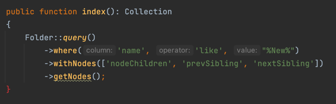

### **What is Nested set model?**

The nested set model is a technique for representing nested set collections (also known as trees or hierarchies) in relational databases (as Wikipedia).

Above image is a collection with multiple level nodes, "Devices" node parent has multiple node children which are "Phone", "Laptop", and each node child has multiple children of children... With a node will have right and left values. Yeah, this is nested set model!

### **Why should we use Nested set model?**

As usually, we use recursion technique to get each levels. Ex: with above devices list, to get all children of "Devices" node, we must recursively loop each node to find its children, let count total of queries:
1. _Find children of "Devices" ("Phone", "Laptop")._
2. _Find children of "Phone" ("Apple", "SamSung")._
3. _Find children of "Apple" ("Iphone", "Iphone Pro Max")._
4. _Find children of "SamSung" ("Note")._
5. _Find children of "Note"._
6. _Find children of "Laptop" ._

Six queries to get children of Devices, it's seem not a big problem? But we imagine increase number of node levels up to 100 1000 or 10.000,... I can't count query total we need :D.

Okay, we try change to use nested set model, that big problem will be solved by this technique. Let count queries again:
1. _Find all node children have Left > 1 and Right < 22._
2. _End. Don't need step 2 :D_

We only use ONE query to solve it, instead of too many queries with recursion. 1 is Left value and 22 is Right value of "Devices" node, nested set model will use the pair to calculate everything by algorithm.

### **How to use:**

Extend `Minh164\EloNest\NestableModel` class for the model we need apply nested set model:

### **CRUD methods:**

Likes base Eloquent Model has Eloquent Builder class, NestableModel also has NodeBuilder class, we will use some methods in this class to implement CRUD logic.

---
### _Create node:_

We use `createNode` method to create new node, this method receives two parameters:
1. `data`: array info we need for new node.
2. `parentId`: Node parent ID which new node will be child. If null, new node will be a new root node.

---
### **Delete node:**

We use `deleteNodes` method:

---
### **Move node:**

You use `moveNode` method to change position of node.

_**WARNING: this method has just only update one record, I will update for multiple records later.**_

Method receives two parameters:
1. _previous_: value at left side of position will be need move
2. _next_: value at right side of position will be need move

NOTICE: _previous_ and _next_ values IS NOT _left_ and _right_ values of node, we should view this image:

If we want move "Apple" to before "HP", then _previous_ and _next_ values are passed to moveNode: **14** and **15**.

---
### **Get nodes:**

Instead of using `->get()` method to get list, we will use `->getNodes()` method to return `NestedCollection` object, this will help you process complicated nested logic:

_**WARNING: for get one record (same as `->first()`) will be updated later.**_

Likely `with` method to get relations, we have `withNodes` to get relations for ALL nested nodes, and also handle by **Eager Load**!

In `NestableModel` has implemented some relations for your Model use it:

We can use both `with` and `withNodes`, but `with` only get relations for parent nodes not for nested children:

And yeah! we also can create a **custom node relation** by extends and override some methods in abstract `Minh164\EloNest\Relations\NodeRelation` class:

Updating.....

